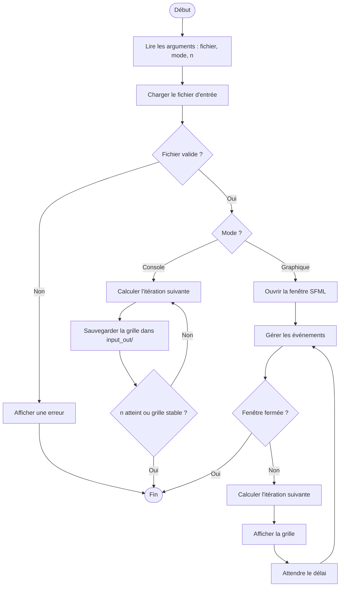
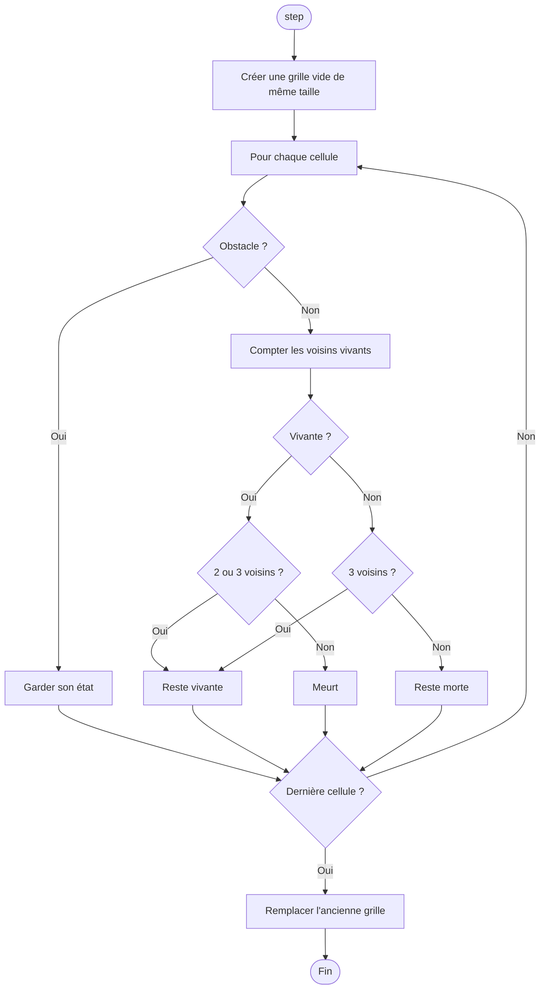

# Diagramme d'activité

```mermaid
flowchart TD
    A([Début]) --> B[Lire les arguments : fichier, mode, n]
    B --> C[Charger le fichier d'entrée]
    C --> D{Fichier valide ?}
    D -- Non --> E[Afficher une erreur] --> Z([Fin])
    D -- Oui --> F{Mode ?}

    F -- Console --> G[Calculer l'itération suivante]
    G --> H[Sauvegarder la grille dans input_out/]
    H --> I{n atteint ou grille stable ?}
    I -- Non --> G
    I -- Oui --> Z

    F -- Graphique --> J[Ouvrir la fenêtre SFML]
    J --> K[Gérer les événements]
    K --> L{Fenêtre fermée ?}
    L -- Oui --> Z
    L -- Non --> M[Calculer l'itération suivante]
    M --> N[Afficher la grille]
    N --> O[Attendre le délai]
    O --> K
```

## Calcul d'une itération (détail)

```mermaid
flowchart TD
    A([step]) --> B[Créer une grille vide de même taille]
    B --> C[Pour chaque cellule]
    C --> D{Obstacle ?}
    D -- Oui --> E[Garder son état]
    D -- Non --> F[Compter les voisins vivants]
    F --> G{Vivante ?}
    G -- Oui --> H{2 ou 3 voisins ?}
    H -- Oui --> I[Reste vivante]
    H -- Non --> J[Meurt]
    G -- Non --> K{3 voisins ?}
    K -- Oui --> I
    K -- Non --> L[Reste morte]
    E & I & J & L --> M{Dernière cellule ?}
    M -- Non --> C
    M -- Oui --> N[Remplacer l'ancienne grille]
    N --> O([Fin])
```
