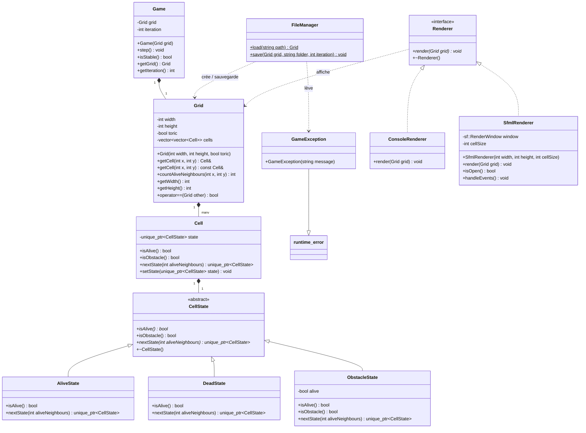

# Diagramme de classes
 

```mermaid
classDiagram
    %% ===== Cellules (pattern State) =====
    class Cell {
        -unique_ptr~CellState~ state
        +isAlive() bool
        +isObstacle() bool
        +nextState(int aliveNeighbours) unique_ptr~CellState~
        +setState(unique_ptr~CellState~ state) void
    }
 
    class CellState {
        <<abstract>>
        +isAlive()* bool
        +isObstacle() bool
        +nextState(int aliveNeighbours)* unique_ptr~CellState~
        +~CellState()
    }
 
    class AliveState {
        +isAlive() bool
        +nextState(int aliveNeighbours) unique_ptr~CellState~
    }
 
    class DeadState {
        +isAlive() bool
        +nextState(int aliveNeighbours) unique_ptr~CellState~
    }
 
    class ObstacleState {
        -bool alive
        +isAlive() bool
        +isObstacle() bool
        +nextState(int aliveNeighbours) unique_ptr~CellState~
    }
 
    %% ===== Plateau et moteur =====
    class Grid {
        -int width
        -int height
        -bool toric
        -vector~vector~Cell~~ cells
        +Grid(int width, int height, bool toric)
        +getCell(int x, int y) Cell&
        +getCell(int x, int y) const Cell&
        +countAliveNeighbours(int x, int y) int
        +getWidth() int
        +getHeight() int
        +operator==(Grid other) bool
    }
 
    class Game {
        -Grid grid
        -int iteration
        +Game(Grid grid)
        +step() void
        +isStable() bool
        +getGrid() Grid
        +getIteration() int
    }
 
    %% ===== Fichiers =====
    class FileManager {
        +load(string path)$ Grid
        +save(Grid grid, string folder, int iteration)$ void
    }
 
    %% ===== Exceptions =====
    class GameException {
        +GameException(string message)
    }
 
    %% ===== Affichage =====
    class Renderer {
        <<interface>>
        +render(Grid grid)* void
        +~Renderer()
    }
 
    class ConsoleRenderer {
        +render(Grid grid) void
    }
 
    class SfmlRenderer {
        -sf::RenderWindow window
        -int cellSize
        +SfmlRenderer(int width, int height, int cellSize)
        +render(Grid grid) void
        +isOpen() bool
        +handleEvents() void
    }
 
    %% ===== Relations =====
    Cell "1" *-- "1" CellState
    CellState <|-- AliveState
    CellState <|-- DeadState
    CellState <|-- ObstacleState
 
    Grid "1" *-- "many" Cell
    Game "1" *-- "1" Grid
 
    GameException --|> runtime_error
    FileManager ..> GameException : lève
    FileManager ..> Grid : crée / sauvegarde
 
    Renderer <|.. ConsoleRenderer
    Renderer <|.. SfmlRenderer
    Renderer ..> Grid : affiche
```
 