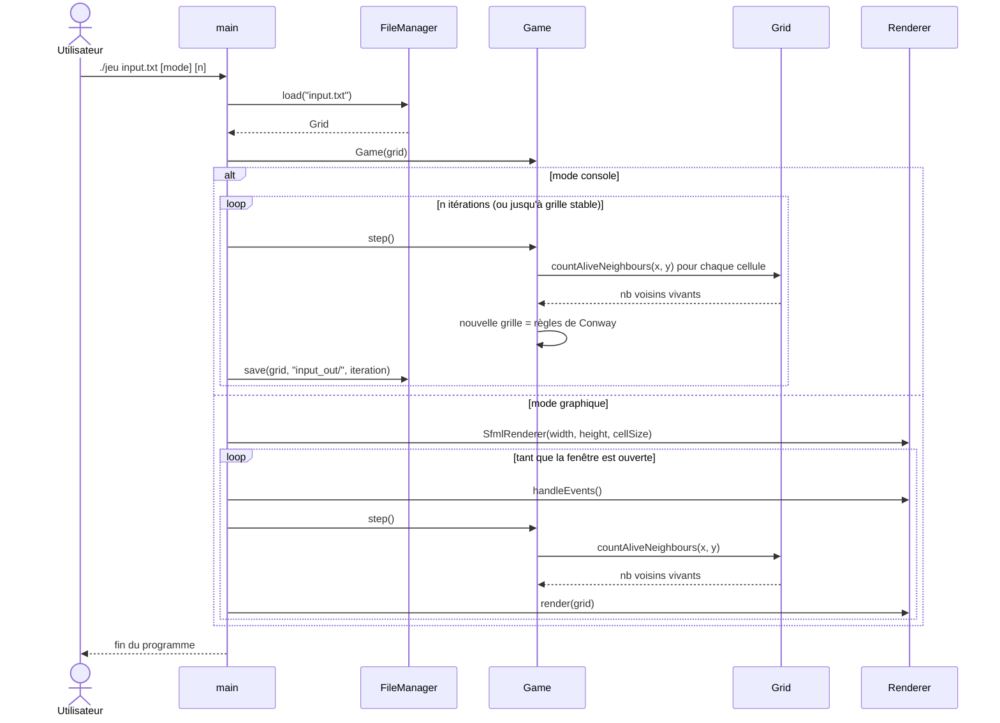

# Diagramme de séquence

```mermaid
sequenceDiagram
    actor U as Utilisateur
    participant M as main
    participant F as FileManager
    participant G as Game
    participant Gr as Grid
    participant R as Renderer

    U->>M: ./jeu input.txt [mode] [n]
    M->>F: load("input.txt")
    F-->>M: Grid
    M->>G: Game(grid)

    alt mode console
        loop n itérations (ou jusqu'à grille stable)
            M->>G: step()
            G->>Gr: countAliveNeighbours(x, y) pour chaque cellule
            Gr-->>G: nb voisins vivants
            G->>G: nouvelle grille = règles de Conway
            M->>F: save(grid, "input_out/", iteration)
        end
    else mode graphique
        M->>R: SfmlRenderer(width, height, cellSize)
        loop tant que la fenêtre est ouverte
            M->>R: handleEvents()
            M->>G: step()
            G->>Gr: countAliveNeighbours(x, y)
            Gr-->>G: nb voisins vivants
            M->>R: render(grid)
        end
    end

    M-->>U: fin du programme
```
