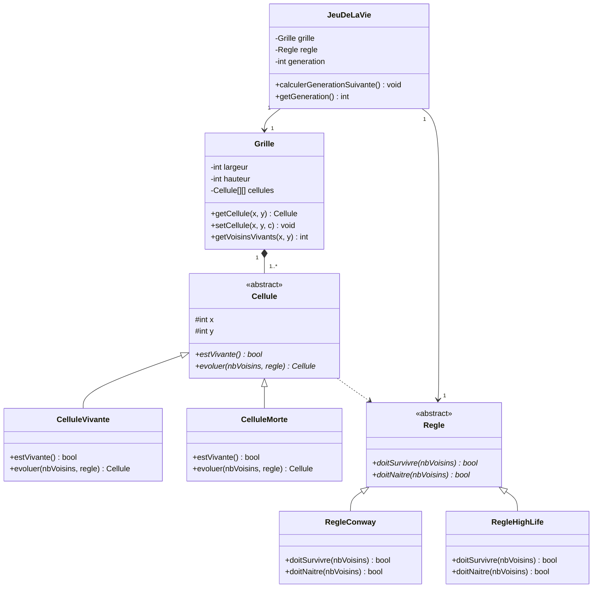

```mermaid
classDiagram
    class JeuDeLaVie {
        -Grille grille
        -Regle regle
        -int generation
        +calculerGenerationSuivante() void
        +getGeneration() int
    }

    class Grille {
        -int largeur
        -int hauteur
        -Cellule[][] cellules
        +getCellule(x, y) Cellule
        +setCellule(x, y, c) void
        +getVoisinsVivants(x, y) int
    }

    class Cellule {
        <<abstract>>
        #int x
        #int y
        +estVivante()* bool
        +evoluer(nbVoisins, regle)* Cellule
    }

    class CelluleVivante {
        +estVivante() bool
        +evoluer(nbVoisins, regle) Cellule
    }

    class CelluleMorte {
        +estVivante() bool
        +evoluer(nbVoisins, regle) Cellule
    }

    class Regle {
        <<abstract>>
        +doitSurvivre(nbVoisins)* bool
        +doitNaitre(nbVoisins)* bool
    }

    class RegleConway {
        +doitSurvivre(nbVoisins) bool
        +doitNaitre(nbVoisins) bool
    }

    class RegleHighLife {
        +doitSurvivre(nbVoisins) bool
        +doitNaitre(nbVoisins) bool
    }

    JeuDeLaVie "1" --> "1" Grille
    JeuDeLaVie "1" --> "1" Regle
    Grille "1" *-- "1..*" Cellule

    Cellule <|-- CelluleVivante
    Cellule <|-- CelluleMorte

    Regle <|-- RegleConway
    Regle <|-- RegleHighLife

    Cellule ..> Regle

```

# jeu-de-la-vie
Projet block POO CPI A2
